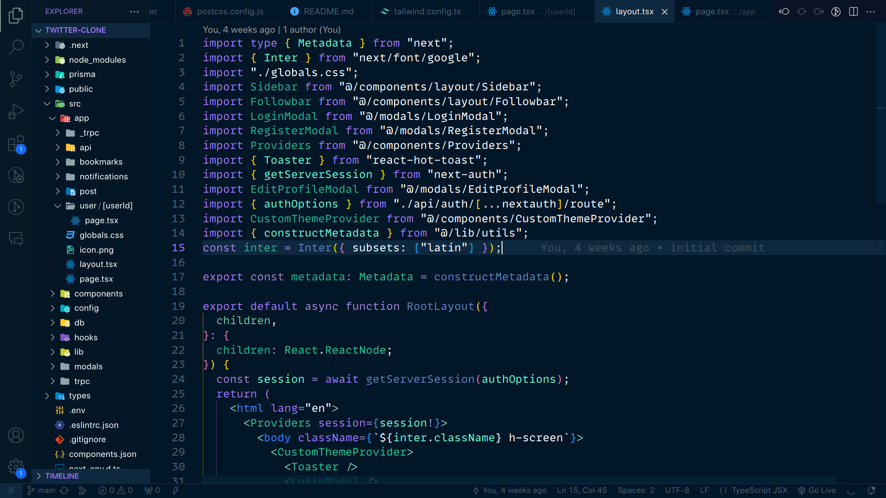

# Late Night Coding Theme 🇮🇳.

## Preview



## Installation
Launch VS Code Quick Open (Ctrl+P), paste the following command, and press enter.
```bash
ext install ManojKumar.late-night-coding-theme
```

## Connect with me-
* [Website](https://manoj-kumar-portfolio.vercel.app/)
* [Github](https://github.com/iamsdiar07)
* [Twitter](https://twitter.com/iamsdiar07)
* [Linkedin](https://www.linkedin.com/in/iamsidar/)


**Enjoy! 🥳**